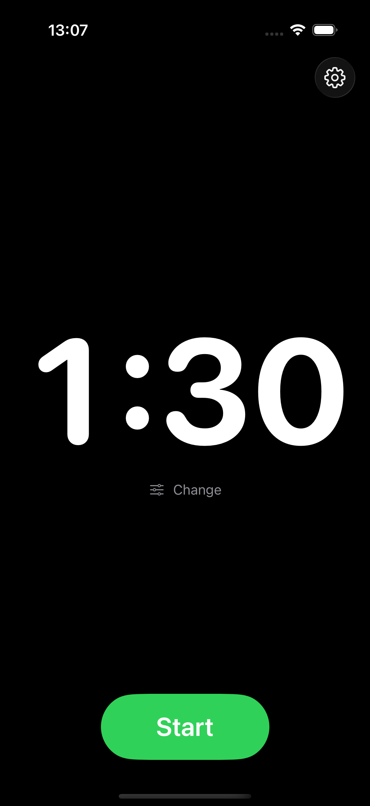
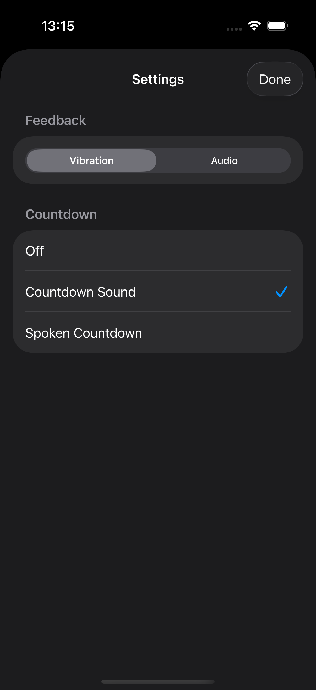
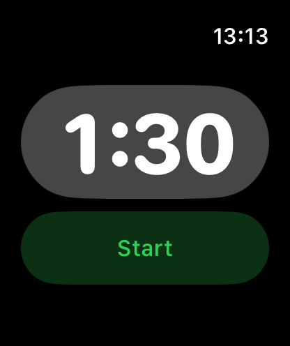
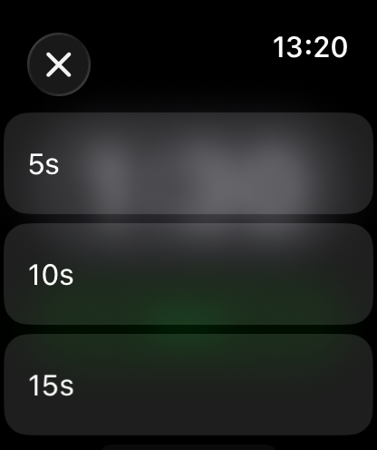

# WorkoutTimer

[](LICENSE)
[](https://swift.org)
[](https://developer.apple.com)

A minimal interval timer for iOS and Apple Watch, built with SwiftUI. Set a duration, tap start, and get notified when each interval completes — with haptics, audio beeps, or a spoken countdown.

### iOS

<p align="center">
  
  &nbsp;&nbsp;&nbsp;&nbsp;
  
</p>

### watchOS

<p align="center">
  
  &nbsp;&nbsp;&nbsp;&nbsp;
  
</p>

## Features

- **Dual platform** — native apps for iOS and Apple Watch with shared core logic
- **Configurable intervals** — 5 to 120 seconds in 5-second steps
- **Continuous cycling** — timer automatically restarts after each interval
- **Optional break time** — configurable break between rounds (1–100 seconds), disabled by default
- **Feedback options** (iOS)
  - Haptic vibration
  - Audio beep
  - Countdown sounds (3, 2, 1, done)
  - Spoken countdown with text-to-speech
- **Background support** — keeps running via extended runtime sessions (watchOS) and background audio (iOS)
- **Localized** — English and German
- **Zero dependencies** — built entirely with Apple frameworks

## Requirements

- Xcode 26+
- Swift 6
- iOS 26.0+ / watchOS 10.0+

## Getting Started

1. Clone the repository:
   ```bash
   git clone https://github.com/wollodev/WorkoutTimer.git
   cd WorkoutTimer
   ```

2. Generate the Xcode project (requires [XcodeGen](https://github.com/yonaskolb/XcodeGen)):
   ```bash
   xcodegen generate
   ```

3. Open `WorkoutTimer.xcodeproj` in Xcode

4. Select the **WorkoutTimeriOS** or **WorkoutTimerWatch** scheme and run

## Architecture

```
Shared/                          # Cross-platform code
├── Model/TimerEngine.swift      # Core timer logic with tick/reset cycle
├── Protocols/HapticPlayer.swift # Platform-agnostic haptic interface
└── Views/DurationFormatter.swift

WorkoutTimerWatch/               # watchOS app
├── Model/TimerManager.swift     # Wraps TimerEngine + WKExtendedRuntimeSession
└── Services/                    # Watch haptics, runtime session management

WorkoutTimeriOS/                 # iOS app
├── Model/
│   ├── iOSTimerManager.swift    # Wraps TimerEngine + audio/haptic feedback
│   └── FeedbackSettings.swift   # User preferences (persisted to UserDefaults)
└── Services/                    # Haptics, audio, spoken countdown, background audio
```

The `TimerEngine` handles all timing logic and is shared between platforms. Each platform wraps it in a manager that adds platform-specific feedback (WatchKit haptics and extended runtime on watchOS; UIKit haptics, AVFoundation audio, and speech synthesis on iOS).

## Running Tests

```bash
# iOS tests (TimerEngine + DurationFormatter)
xcodebuild test \
  -scheme WorkoutTimeriOS \
  -destination 'platform=iOS Simulator,name=iPhone 17'

# watchOS tests (TimerManager + session management)
xcodebuild test \
  -scheme WorkoutTimerWatch \
  -destination 'platform=watchOS Simulator,name=Apple Watch Series 11 (46mm)'
```

## Contributing

See [CONTRIBUTING.md](CONTRIBUTING.md) for guidelines.

## License

This project is licensed under the MIT License — see the [LICENSE](LICENSE) file for details.
